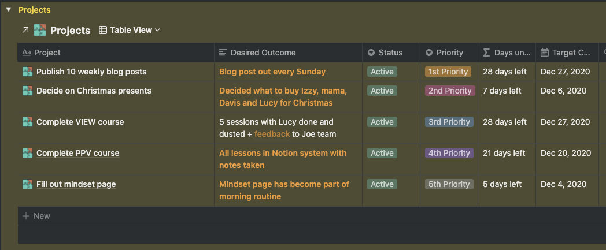

The paradox of choice says that the more options we have the less satisfied we'll feel. Choosing one thing means we have to give up all the other options and whatever we decision we go with, we'll always wonder if we could have made a better one.

A lot of the time instead of making a decision, we get stuck in analysis paralysis. This of course hides the truth that not making a decision is itself a decision we're making, and even worse, it's guaranteed to be a bad one.

This doesn't just apply to big decisions like what to study at university or who to make a long-term romantic commitment to. When trying to create anything, the paradox choice often stops us in our tracks as we are unable to decide between the infinity of choices that creation entails.

I've faced these problems when trying to decide what to write about. Nowadays I'm exposed to life-changing ideas on a constant basis. Information is flowing past us at a rate not experienced by any other generation. So I become stuck. How do I decide which of these ideas to hone down on?

I've talked in the past about how creativity often comes down to hacking our way to a result. And the best hack I've been using lately is constraints. This is a paradigm shift that's still evolving within me but already I've seen so many glimpses of its usefulness.

I love creating this blog because it gives me a creativity playground to test all of these insights on. Here's how constraints have come in useful.

- Committing to spending 2 hours every Sunday writing it is allowing me to conquer perfectionism. I sit down for that time and then press publish at the end no matter what comes out. This has made my goal of establishing a regular writing routine a realistic one. Before I would commit to writing a blog and then sit for hours and hours trying to get the perfect one out. And you know eventually I would publish something. But then I would "forget" about my blog for a long time. A part of me knew that this process wasn't sustainable and so it was easier to ignore this goal altogether.
- Digging down a layer, when sitting down for these 2 hours, I spend the first one in divergence mode, looking for ideas about what to write about and giving them some structure. By the end of the hour I have an outline and the message I want to communicate. Without this message, sitting down to write turns into a stream of consciousness. There are so many things I want to say. But again too much choice means I end up saying nothing at all.

For example this was the core message that I wanted to express in this post:

> Constraints will set you free. They are the cure for perfectionism because they make the important come to the fore. They are the engine for creativity. It is where the saying "Necessity is the mother of all invention" comes from. The thing is we don't need to wait for constrained conditions. We can create those constraints ourselves!

Now when I'm writing I have mechanism for knowing if I'm veering off track. Is what I'm writing relevant to the core truth I'm trying to communicate? No? Well then get back on track!

These small tweaks have made the experience of writing much more enjoyable. Before I was trying to diverge and converge on the fly. I had no way of knowing when the divergent phase of writing was over and so would keep oscillating between divergence and convergence.

Of course there is no limit to divergence because of the abundance of information nowadays. Research can go on for as long as we want. So I'd be sitting there for hours and hours and the joy I get out of playing with ideas would be replaced by a resignation that they would never fit together.

So I'm using a deadline and tightly defined scope to make the process of writing more enjoyable. Does this apply to any other aspects of life?

Well for all the [GTD](https://www.goodreads.com/book/show/1633.Getting_Things_Done) nerds out there, adding these same two constraints to my project list has led to huge benefits. It is counterintuitive because my initial reaction was that I didn't want extra pressure. But just as with writing, when my projects were vague, I would never know if they were completed. Looking at the same project list, stagnating there week after week was a sure fire way to kill my motivation.

---

*Project with desired outcomes and target completion dates*

---

Just as how when writing a blog you can veer into writing something irrelevant to the message, when working towards our goals we can veer off into busyness instead of actions that will move us closer to our desired outcome. Having this desired outcome front and centre, we have a perfect way to measure if an action we're taking (eg replying to emails) is really the activity that will move the needle forward.

I love seeing these parallels between what have traditionally been seen as creative pursuits (ie writing) and other pursuits like running a business or even buying Christmas presents. Because ultimately our life as a whole is our most important creation. Buying Christmas presents is part of how I create a life full of deep and meaningful relationships, taking courses is how I create a life filled with wonder and writing this blog is how I create a life full of, well, creation.

So it makes perfect sense that wisdom from creators past and present can help us out in our everyday affairs. Constraints help me ensure that I maintain the balance between all of these areas of my life and that is something I'm feeling very grateful for right now 😊.