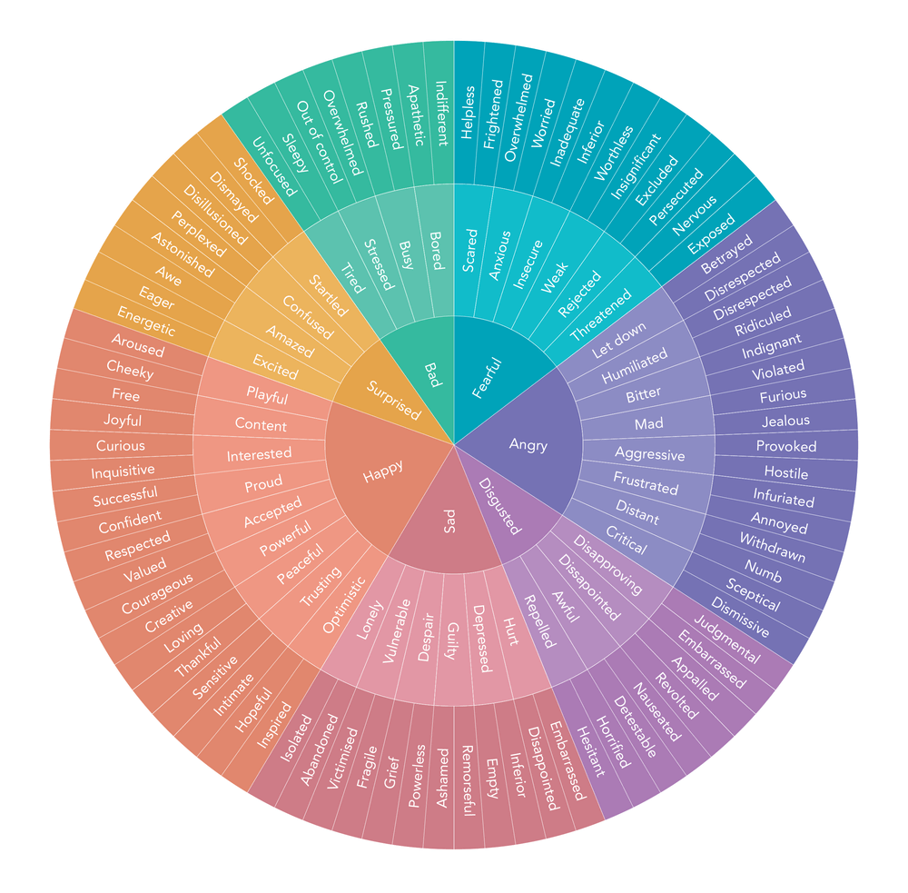
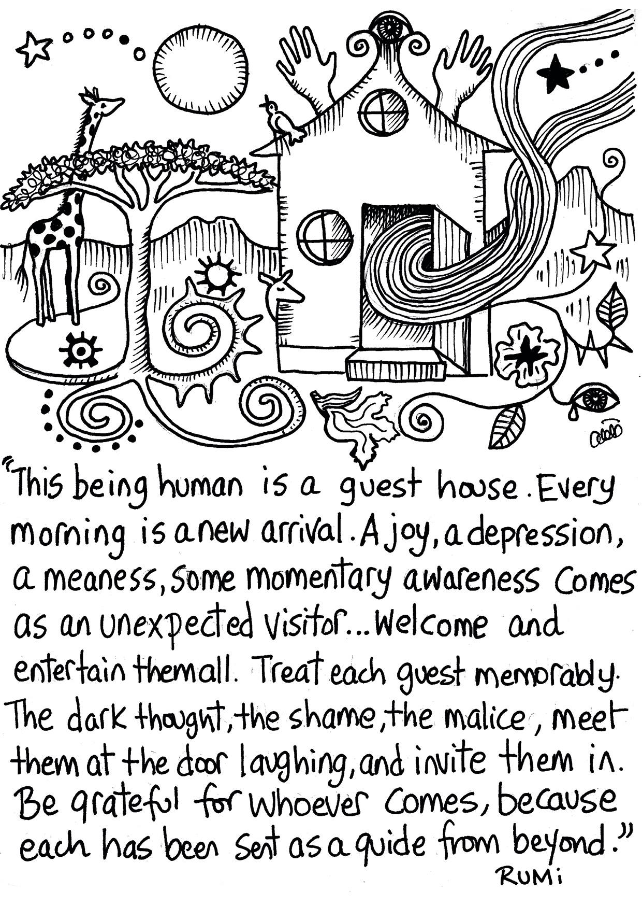

In 2020 I learnt that all my emotions are wise guides full of teachings. I also realised I'd forgotten this truth for most of my adult life. Somewhere along the way I learnt that there were "good" and "bad" emotions, and the goal in life was to maximise the good ones and eliminate the bad ones.

For this reason I developed a whole arsenal of avoidance strategies. Of course, if you'd asked me why I was getting stoned, watching so much TV or eating junk food, I would have told you that I enjoyed all these activities. The avoidance was mostly occurring at a level below conscious awareness.

## Why we block "negative" emotions

As part of *[Art of Accomplishment](https://learn.fortelabs.co/p/the-art-of-accomplishment-application)* we learnt why we don't feel safe letting "negative" emotions in. From a very young age we learn which emotions aren't socially acceptable. We throw a tantrum and are punished for it, and in the process we develop the belief that showing anger will lead to rejection.

By the time we're adults we've forgotten about this belief. It is buried deep in our psyche, leading us to assume that that's just how the world is. Without realising, we've conditioned ourselves to block off a large part of our emotional landscape.

We've blocked emotions like anger for so long that our nervous system is not used to them. When they arise, they're intense physiological experiences, and this intensity triggers a fear that they'll overwhelm us.

Again, this isn't a conscious process. But somewhere deep down there is a fear that if we allow sadness in, it will turn into a permanent depression. This doesn't just apply to sadness though. For each of the "negative" emotions we block, we have an underlying fear about what would happen if we let them in:

"If I allow anger in, I'll hurt myself or others"

"If I allow fear in, I'll be unable to act and I'll fail"

Seeing these fears written out explicitly, they might appear exaggerated. The truth is they are. Yet explicitness is the domain of the intellect. Emotions work at a more foundational, implicit level. Using logic to understand how misguided these fears might be hasn't helped much in moments where sadness threatens to envelop me.

While logic may not help in the moment, it can help us understand our behaviour. If wanting to avoid "negative" emotions is the root cause of bad habits, then whatever is making us want to avoid these feelings must be a powerful force.

After all, everyone wants to eat less junk food, spend less time in front of screens, and lead a less sedentary lifestyle. Our strong desire to give these addictions up is pitted against our fear of what might happen if we let these feelings in, and unfortunately the fear wins out most of the time.

## What happens when we let emotions in

When I learnt about these emotional mechanisms, I was still doubtful whether this perspective on emotions corresponded to my experience. So I decided to start paying close attention to what happens internally when strong emotions arise in my day to day.

For example, a few weeks ago my girlfriend went on holiday. Her adventurous streak meant that she didn't have a place to stay on her first night, the plan was to work it out when she got there. That night, it started getting late and I hadn't heard from her, so I tried to call her. Straight to answer machine. Same result when I tried calling 5 minutes later.

This is when anxiety started flooding in. And along with anxiety, negative, looping thoughts:

"What if something's happened to her?"

"What if she's had an accident?"

...

Then I remembered, in the past people didn't have phones. They assumed their faraway loved ones were fine unless they heard otherwise. I was being silly. Yes everything's fine, I can stop worrying and watch some TV.

Except of course that rationalisations don't have much of an impact on emotions. The anxiety was still there. And what I thought was me getting on with my night, was actually a mechanism for suppressing it. A way to distract myself.

I caught myself though. These teachings were fresh in my mind. We'd learnt about how and why we block emotions, and were invited to experiment with doing the opposite. So I sat still and tried to welcome whatever came up in my experience.

It's simple to sit still and embody a welcoming attitude. Yet, that doesn't make it an easy process. I tried to go into the anxiety as much as possible. This meant going into the fear that she might be dead and feeling everything that came along with that.

I should point out again that this isn't a logical process. On a logical level, I knew the likelihood that she was okay and that she would soon be in touch was much higher than any of the horrible scenarios running through my head.

Yet, these rationalisations are the excuses we give ourselves for blocking emotions. To fully feel them, we have to drop them and allow the fear to rise up in us. Unlike our intellect, fear doesn't care whether the horrible imagery running through our minds is realistic. Allowing "negative" emotions means letting the worst-case scenarios play themselves out. Needless to say, this is incredibly difficult and explains why we'd rather distract ourselves.

## Allowing Emotions to Move

What the aim of all this though? Do we benefit or is it pure masochism?

It turns out that our fears are telling us a story that's completely backwards. We think that if we allow "negative" emotions in they'll overtake us, whereas what actually happens is that welcoming them is what allows them to move. It's no coincidence that "emotion" has the word motion in it. Its etymology can be traced to the Latin for to move, *movere*. They want to move, it's in their nature. But for this to happen, we have to let them come to the surface.

The reason our anger stays with us much longer than is necessary is our resistance to it. What we resist persists. We block our emotions because we believe if we're in control of them, they won't take control of us. In fact the opposite happens. Here's Joe Hudson on our resistance to emotions:

> These are the traditional thought processes that people have about why emotions aren't safe. The reason that they feel that way is because that's how the resistance is. When you're resisting anger, you do destroy shit. When you are resisting sadness, it does last forever. It looks like depression. When you're resisting fear, then you're anxious all the time, and you are frozen. You're not doing stuff. People have confused the resistance with the emotion.

Any teaching that we receive is at best a hypothesis until we have verified it in our personal experience. Coming back to my example, I sat there and felt the pain of loss as the imagery ran through my head. I felt discomfort all over my body, especially around my chest which became heavy and tense. I also felt my throat tensing up, and tears wanting to come to the surface.

Yet before they did, the tension began to dissolve. Suddenly my chest didn't feel so heavy. And the mental imagery dispersed too. I'd been told to expect this. We'd learnt that on the other side of fear, rather than more anxiety we'd find fearlessness. This process was surprising and novel. It's one thing to hear someone talking about it, another thing to live through it.

## Running Experiments & Caveats

The invitation then is stop judging emotions as either good or bad, and fully welcome all of them.

Of course, this is much easier said than done. It's important to point out that feeling our emotions is a skill to be mastered. If we've spent years resisting them, we might take some missteps to begin with. We might open up, and in the process get overtaken by them, confirming our fears. It's helpful to expect this and not be discouraged. We're risking a little destruction in the moment, with a view to transforming our relationship with these feelings.

The most important thing to remember is to not do it at anybody. There are ways to feel and express our anger without directing it at anyone. My pillows have taken a hell of a beating since I learnt these lessons.

The same goes for sadness and fear. When we learn appropriate ways give expression to these emotions, we'll be more willing to embrace them with the security that they won't hijack our actions. We'll then be able to receive the lessons that every one of our emotions offers us. Perhaps Rumi says it best:

