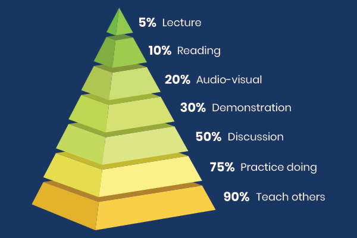

This post is the first in a two part series explaining how learning works and what we can do to become more efficient life-long learners. This first part is about the science of the learning process while the upcoming post will deal with the methods for improving our studying techniques. Stay tuned!

---

When I tell someone that I've started a blog, they usually ask me what it's about. A lot of blogs are about one specific topic so the question makes sense. Unfortunately, I didn't set out to write about anything in particular, so the response that comes to mind is that I'm writing about concepts that interest me. Still, I knew that didn't quite capture my intentions. Preparing for this latest post, it dawned on me that the common factor amongst the topics I want to write about is my desire to deepen my understanding of them. Non-fiction writing, such as this blog, often appears to be a sort of report on previously acquired knowledge. What I'm discovering though, is that the act of writing itself can be the vehicle by which I learn about something. It helps to bring order and structure to what I'm learning, as well as allowing me to immerse myself in it, so that it goes from being a topic that I can have a fun intellectual discussion about to something I can put into practice in my life.

So what's the first topic I want to explore at a deeper level? Well, two of my favourite mental games are going meta and unearthing root causes. It was a no-brainer then, to decide to take my learning about how to learn to a deeper level. In this post I'm going to explain to you what I've learnt about how learning works and how to best leverage the most current scientific research to turbo charge your own learning.

## A model for learning

Knowing about the learning process will help us when we look at study techniques and why some are more effective than others. Here's an overly simplistic (but still useful!) 3 step model for how it works:

1. **Encoding**

    When we first encounter new material, it is stored (i.e. encoded) as *memory traces* in our short term memory. These traces are very fragile and most of them are discarded. There's a good reason for this — the amount of information we're exposed to every day is astronomical and most of it quickly becomes irrelevant. The price of dinner, what time the film's showing, our friend's post code, all become unimportant after the fact. If we didn't lose these traces we'd have difficulty sorting through the ever-growing mountain of clutter in our heads. For the important memories that we do want to keep, the next step in the process is consolidation.

2. **Consolidation**

    When we first learn how to do something, say reverse parking, our knowledge is hazy at best. Someone's shown us the steps to take and which order to take them in, but we know we would get into a mess if we tried to do it ourselves. We have to give it time to sink in.

    Consolidation is exactly this bedding in process and it takes place over several hours after the initial learning. In this time "the brain reorganises and stabilises the memory traces". One theory for how the brain achieves this, is that it rehearses and replays the new material somewhere away from our conscious awareness. This might explain why sleep is an integral part of the learning process.

    The new knowledge is given meaning by connecting it to previous knowledge. In fact, this is one of most notable and interesting points that I came across — that **"prior knowledge is a prerequisite for making sense of new learning."** It is by making connections to previously acquired knowledge that we can glean understanding and meaning from new material. **A corollary of this point is that the more we know the more we can know.**

    The relative ease with which polyglots learn yet another language demonstrates how this works. By the time they get to their fourth or fifth language, picking up another one has become a lot easier. They've developed strong interconnected structures in their brains related to how languages work. When they try to learn a new one, they have plenty of ready-made hooks that they can anchor their new learning to, making the likelihood of it sticking much higher.

3. **Retrieval**

    Making the learning robust and durable is the last piece of the puzzle. This is where retrieval comes in. The process of *consolidation* created neural pathways in our brain representing new learning. Being new, these pathways are still fragile and easily altered. To cement our new knowledge we have to strengthen these memory traces, and this can only be done at a later time by making an effort to remember what we were taught.

    The term neural pathway guides us to a helpful analogy for understanding how retrieval strengthens memories. It like making a path in a dense forest. Every time we recall prior learning, we are walking this path and this very act makes it easier for us to walk it the next time round. By the 1000th time we've walked the path, having macheted all obstacles away, the going is easy, it takes no effort at all. By the same token, it takes no effort at all to surface memories that we've had to consciously retrieve over and over again. Items like our phone number and address appear instantly in our minds without our even trying.

    Linked to retrieval is an aspect to memory that is usually forgotten 🙃. It's not enough to have strong neural pathways representing our memories, we must also have a set of cues associated with them. These cues will reactivate the memories when we need to use them. An example of a memory cue at work is when a long-forgotten song triggers flashbacks of a time in our childhood that we haven't thought about in years. Here the song is the cue, the signpost that gets us on the right neural path. The memory episode in this specific example obviously had very few cues associated with it, which explains why we hadn't thought about it for a long time. Any learning or memory that we want to apply to solving problems in our present everyday lives, must be associated with a diverse set of cues. The more cues we have, the more fluent that learning becomes.

    The importance of these cues for memory and learning can be gleaned from mnemonic devices such as [memory palaces](https://litemind.com/memory-palace/). Like most memory enhancement techniques, they work by the conscious effort of adding memorable cues to whatever we are trying to remember. With memory palaces, you imagine yourself in a space you are familiar with, say your living room. You then associate objects within the space (a sofa) with a visual image representing what you want to remember (a guitar). Later on, when you get that nagging feeling you've forgotten to do something, you take a trip inside your mind's eye coming across the sofa with a guitar lying on it and you instantly remember that you have to buy the concert tickets!

## How we delude ourselves

We need to understand one last principle before we discuss the actual structures and practices that make for great learning. Stick with me, it'll be worth it.

In the last 50 years, psychology has shown the myriad ways that we, as humans, systematically delude ourselves. There are a number of these [cognitive biases](https://yourbias.is/the-sunk-cost-fallacy), like *confirmation bias*, where we try to fit any new information that we come across into our pre-existing beliefs and dismiss it otherwise, *the sunk cost fallacy*, where we cling onto something that we've invested time or money into even though we should let it go (finishing a 1000 page book we're not enjoying) and *the halo effect*, where finding a stranger attractive leads us to attribute unrelated positive qualities unto them (they must be so clever and healthy too!).

The domain of learning is not immune to these illusions — in fact, they are the biggest source of wasted time and effort as we try to master a subject. I'll expand on this throughout the post but the basic principle is: **the easier learning feels, the more confident we will be that we are retaining the information, while in actuality our new knowledge will be superficial and soon forgotten**. The inverse is also true - learning that is hard does not feel good or productive, yet it will lead to the best results. Another example of the [counter-intuitive nature of life](https://www.youtube.com/watch?v=LGpYE-FZRhA).

I came to this realisation much later than I would have liked when, a few years go, I was journaling about what I felt were my ineffective learning habits. I knew I could be getting more out of the effort I was putting in and I had an insight that my learning methods were all too passive. I realised that just reading books or watching videos on a topic did not lead to robust knowledge about it. This seems obvious in hindsight but at the time it was a revelatory experience. I was gaining some awareness into the illusions we fall for when we try to assess how well we are progressing towards our learning goals. It goes something like this — we read a well written passage of text, one that explains a foreign concept to us with flowing ease. This ease and flow lead us to conclude that we've understood the concepts fully. In reality, were someone to ask us to explain what we just read, we would instantly become aware of all the missing links we'd glossed over.

While researching this blog, I discovered the learning pyramid which helps to illustrate the point I'm making. It shows us the estimated retention rates (i.e. how much learning actually sticks) for different learning strategies. The top half of the pyramid is the passive learning I'm referring to. It highlights all the ways we delude ourselves into thinking we are taking in much more than we actually are. Listening to a lecture, reading a book or watching a video are all activities where it is "in one ear and out the other" as my mum likes to say. You might have experienced what this feels like when you wanted to tell someone about the interesting book on politics that you just finished, but you ended up stumbling over your words, unable to reconstruct the coherent argument that was so easy to follow when you were reading.

The bottom half on the pyramid show us the learning practices that actually work. Discussing what you learnt, putting it in into practice and teaching others about it are the most effective methods for retention of knowledge. What these practices have in common is that they require you to be in active participant in the concepts, ideas and processes that you are trying to master. It becomes a lot harder to delude yourself, that for example, you know how to work out the area of all regular polygons, if you force yourself to actually work out the area of a number different polygons and come up short. Being an active participant makes it much more likely that you will come up against the limits of your knowledge. This of course will not feel good, yet it is an essential element for success in learning. Gaining an awareness of the areas we fall short, as long as we are not put off by the experience, will show us where we need to refocus our efforts in order to increase our mastery.

It is interesting to note that teaching others is the best way to retain what we've learnt. At the beginning of the post I shared with you that one of my main motivations for writing is to develop a deeper understanding of topics that interest me. Here's where we come full circle. I definitely feel my knowledge about the learning process is a lot more detailed and nuanced than when I started writing, even though I haven't done any more reading about it. I'm not sure exactly how this happens, but it might have something to do with making explicit what before was implicit, intuitive understanding. Implicit knowledge is not some complicated concept, it is all around us. Think about a language's grammar — the average person will have no idea about the intricacies of it, it is implicit. While we don't need to learn about grammar to speak a language, learning about it will deepen our understanding and appreciation of it. I think this is what happens in the writing process. We make explicit our mental models and underlying assumptions and having these outside our head allows for a sort of fact checking and for forging new connections that weren't obvious before. It is a little like magic experiencing this process in action, new knowledge springing into consciousness out of seemingly nowhere. I definitely recommend giving it a go!

---

So now we know how learning works, but we still need to transmute the theory into practice. In the next post I'll be talking about self-testing, reflection, elaboration and generation - all practices that we can put to use straight away to get more bang for our learning buck. See you next time 🤓
