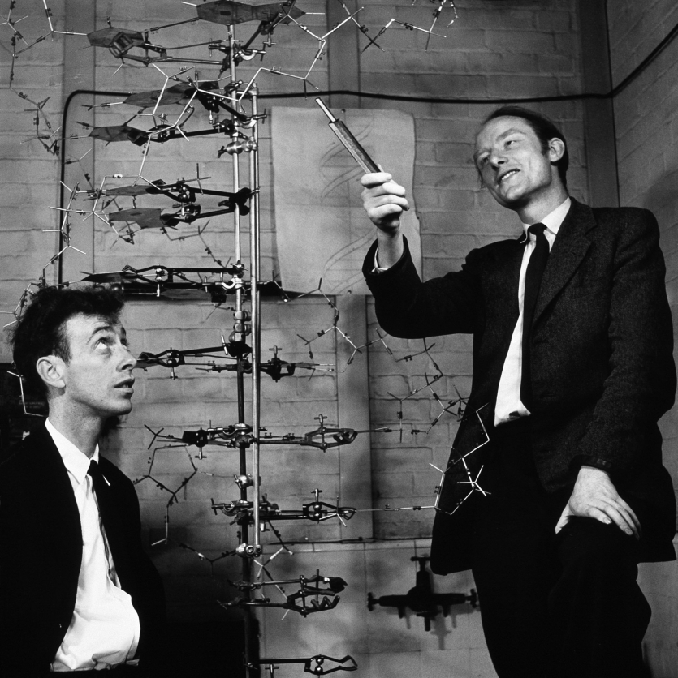
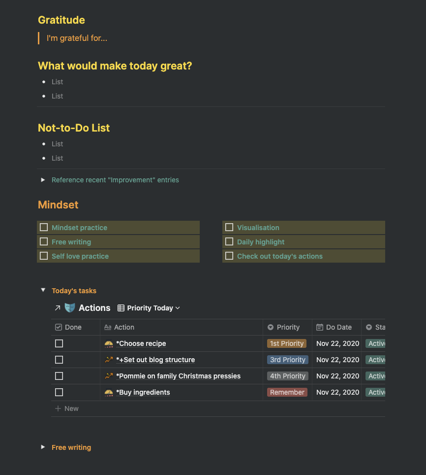

Yet another insight from BASB is that humans are much better at solving problems by playing and tinkering with physical models than by playing and tinkering with abstract models in our heads.

The quintessential example is how Watson and Crick arrived at the structure of DNA. Even though they were highly trained analytical thinkers, they built models of the structures they were investigating to allow them to test and tweak different ideas.

They externalised their thinking into a physical object to allow them to test their hypotheses. Not only this, but once these abstract models became physical, their thinking was reflected back at them sparking insights for fruitful directions to take their investigation.

This is just one example that illustrates our brain's preference for solving problems by utilising our environment. Memory palaces are another. This is a method used by memory champions to memorise large lists of numbers, objects, cards etc. It works by visualising a physical environment that we are intimately familiar with and placing those objects in different locations in our "memory palace".

It's fascinating how this technique leverages our brain's specialised spatial thinking abilities, honed through millions of years of evolution, to make up for our relatively weak memory skills.

Some words from Tiago to illustrate:

> We prefer to think spatially. This isn't just easier, it's our natural mode. To solve problems, abstract, disembodied reasoning and planning is an order of magnitude less effective than interacting with objects in our **physical and virtual** environments.

As Tiago says, this line of thinking extends to digital environments. In fact, this is where I've been having the most fun with this concept. I'm not particularly adept at making physical objects, so I'm very thankful for the tools that allow me to create digital models.

All this talk about models is a bit abstract and the whole thesis of this blog is to get more concrete. So let's do just that. When I am talking about models I'm referring to something as simple as a checklist. The specific example that I have in mind is morning routines. A morning routine could look like this:

- [ ]  Read
- [ ]  Meditate
- [ ]  Morning pages

And just like that I have a model for my morning routine. This appears too simple to be of any use, but externalising something like this has a few benefits. First it offloads any decision making that our bleary eyed selves have to make each morning, we can just mindlessly tick off a checklist.

More importantly though, we can now play with it. For example, we might make it longer or tweak the order if we realise we're too sleepy to read first thing:

- [ ]  Visualisation
- [ ]  Meditate
- [ ]  Morning pages
- [ ]  Read

And after a while of playing and tinkering we may end with a routine uniquely suited to our preferences, personality and dreams:

This is what I love about Notion. The ease with which I can build up structure and tear it down makes it an amazing sandbox for playing with routines and habits in my life. Seeing them externalised, I can reflect on them and ask if I am getting value out of them in a very deliberate and intentional way.

Something I've noticed about having a model for my routines is not only that they become easier to embed, it is also easier to let go of the ones that don't work for me. There's no guilt there because I know I am playing with this model, tinkering to find the best next iteration.

---

Earlier on in BASB we'd learnt that the ideas that challenge us and make us most uncomfortable are the breadcrumbs that we personally need to follow for our biggest breakthroughs. Well, hearing this spatial thinking idea I immediately resisted. I've always been good at mental gymnastics, I was praised for showing off my mental arithmetic when younger. So unavoidably, it became a part of my identity. Needing to write things or draw things out was definitely not for me.

Little did I know how much I was limiting myself! This is one way in which those things that we consider our strengths can actually become our biggest limitations. I guess this post is a small attempt to remedy that.